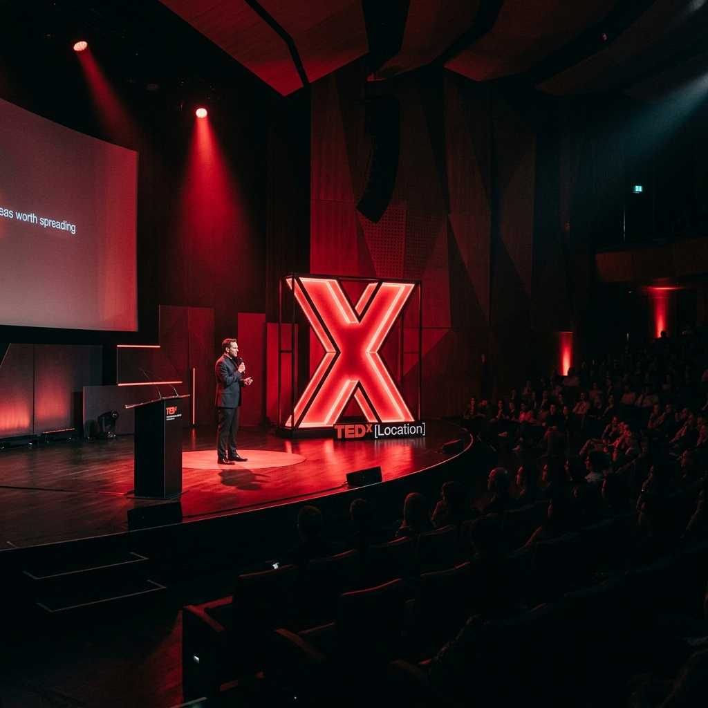

# TEDxTapmi Web Application



A modern, fully responsive, interactive multi-page web application built for **TEDxTapmi** at the **T. A. Pai Management Institute (TAPMI), Manipal**. Designed following official TEDx brand guidelines, featuring an avant-garde dark aesthetic, dynamic multi-page routing, interactive speaker quiz, floating AI guide navigator, masonry photo gallery, past events timeline, and delegate registration portal.

---

## 🌟 Key Features

- **Strict TEDx Design System**: Pure TEDx Red (`#E62B1E`), True Black (`#000000`), and Pure White (`#FFFFFF`), paired with `Space Grotesk` headings and `Inter` body typography.
- **Multi-Page Client Routing**: Instant client-side routing (`#home`, `#speakers`, `#quiz`, `#timeline`, `#gallery`, `#register`) with smooth page enter transitions.
- **Floating Vertical Side Dock**: Quick-jump navigation panel with step indicators, tooltips, and active state animations.
- **Interactive "Which Past Speaker Are You?" Quiz**: 4-question mindset evaluation engine matching attendees to past TEDxTapmi keynote speakers.
- **Past Speakers Directory**: Dynamic filterable speaker roster by category (*Technology, Design, Business, Entertainment*) with detailed modal bios.
- **Past Events Timeline**: Chronological archive of previous TEDxTapmi editions (2021–2025) highlighting themes, speaker counts, and attendance stats.
- **Masonry Photo Gallery**: Category-filtered masonry image grid with fullscreen lightbox zoom viewer.
- **Delegate Registration Portal**: High-conversion pass registration module with real-time field validation, loading animations, and instant digital pass card generation with QR code mockup.
- **TEDx AI Guide Assistant**: Floating interactive chatbot providing instant answers to FAQs, event location, schedules, and pass details.

---

## 🛠️ Tech Stack

- **Core**: HTML5, JavaScript (ES6+), React 18 (UMD)
- **Styling**: Tailwind CSS (CDN), Custom CSS (CSS Variables, Avant-Garde Glassmorphic Panels, Neon Red Borders)
- **Typography**: Google Fonts (*Space Grotesk* & *Inter*)
- **State Management**: React Context API (`CMSContext`) with `localStorage` persistence
- **Deployment**: Vercel & GitHub Pages ready (`vercel.json` rewrite routing pre-configured)

---

## 📁 Project Structure

```text
TedX website/
├── assets/                       # Image assets for speakers, stage, and gallery
│   ├── gallery_audience_...png
│   ├── speaker_creative_...png
│   ├── speaker_entrepreneur_...png
│   ├── speaker_tech_...png
│   └── tedx_hero_stage_...png
├── js/                           # JavaScript source code
│   ├── components/               # Global layout & interactive components
│   │   ├── AIChatbot.js          # Floating AI guide drawer
│   │   ├── Footer.js             # Official TED license footer
│   │   ├── Navbar.js             # Top header navigation bar
│   │   └── SideNavDock.js        # Floating vertical quick-jump dock
│   ├── pages/                    # Dedicated page module views
│   │   ├── GalleryPage.js        # Masonry photo gallery & lightbox
│   │   ├── HomePage.js           # Avant-garde hero, countdown & spotlight
│   │   ├── QuizPage.js           # Interactive speaker mindset quiz
│   │   ├── RegisterPage.js       # Delegate registration & ticket pass
│   │   ├── SpeakersPage.js       # Past speakers directory
│   │   └── TimelinePage.js       # Past events chronological archive
│   ├── app.js                    # Main React entry & router container
│   ├── cmsContext.js             # React Context state management
│   └── data.js                   # Default mock dataset (speakers, gallery, timeline)
├── index.html                    # Main HTML5 entry point
├── styles.css                    # Design system tokens & avant-garde styles
├── vercel.json                   # Vercel deployment rewrite routing rules
├── package.json                  # Deployment metadata
└── README.md                     # Documentation & setup guide
```

---

## 🚀 Deployment Instructions

### Option A: Deploying on Vercel (Recommended)
This repository includes a `vercel.json` file configured with static routing rewrites to prevent `404: NOT_FOUND` errors on subpaths.

1. Push your updated code to GitHub:
   ```bash
   git add .
   git commit -m "Add vercel.json rewrite configuration to fix 404 error"
   git push origin main
   ```
2. In your Vercel Dashboard:
   - Click **Add New** > **Project**.
   - Import your GitHub repository (`tedx-tapmi-website`).
   - Framework Preset: Select **Other** or **Static Store / HTML**.
   - Root Directory: `./` (leave default).
   - Click **Deploy**.
3. Vercel will instantly publish your site with zero 404 errors!

---

### Option B: Local Setup with Python
1. Clone this repository:
   ```bash
   git clone https://github.com/your-username/tedx-tapmi-website.git
   cd tedx-tapmi-website
   ```
2. Run Python server:
   ```bash
   python -m http.server 8080
   ```
3. Open your browser to `http://localhost:8080`.

---

## 📜 License & Official Disclaimer

> **Official TEDx Disclaimer**: This independent TEDx event is operated under license from TED. All TED logos, branding guidelines, and "Ideas Worth Spreading" trademarks belong to TED Conference LLC.

Designed and developed for **TEDxTapmi** at **TAPMI Manipal**.
